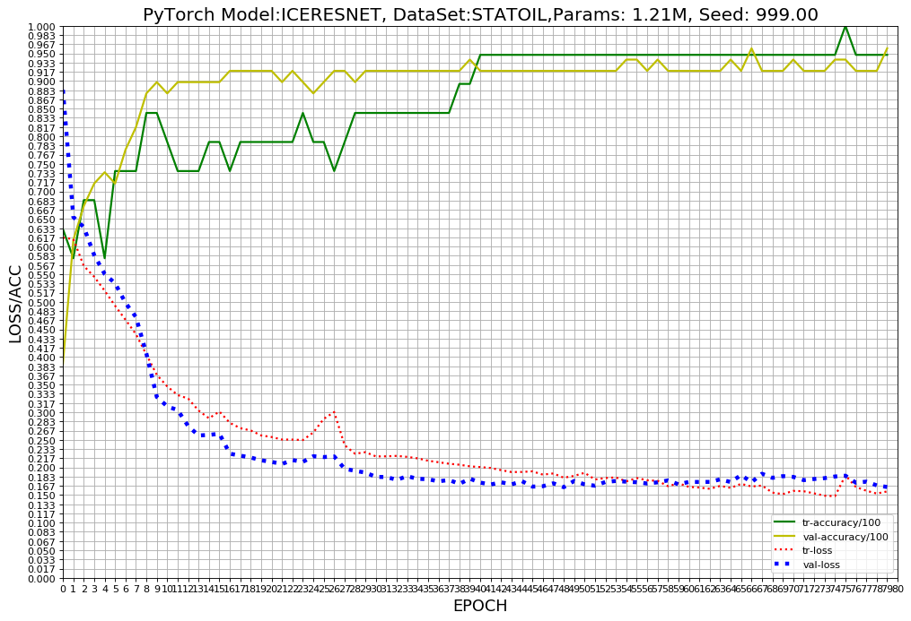

# PyTorch Model Ensembler + Convolutional Neural Networks (CNN) for Kaggle

## [Competition 1 -  Statoil/C-CORE Iceberg Classifier Challenge]( https://www.kaggle.com/c/statoil-iceberg-classifier-challenge)

Learn PyTorch + Kaggle from scratch by examples and visualizations with interactive jupyter notebooks.
Learn to compete in the [Kaggle](https://www.kaggle.com/) competitions using *PyTorch model ensembles*.

- All competitions are designed to be run from a GPU.
- Default model is SENet.
- Default classification is Binary 
- Default number of Image dimentions is 2.   
- Default number of Epochs is 57 for SENet.
- Default batch size is 32. 
- Refer to the code to see all the arguments.   

## Credits

[Shlomo Kashani](https://github.com/QuantScientist/Deep-Learning-Boot-Camp/) 

## Setup and Installation

Guides for downloading and installing PyTorch using Docker can be found [here](https://github.com/QuantScientist/Deep-Learning-Boot-Camp/tree/master/docker).

### Requirements

- Python (3.5.2)
- PyTorch (2.0.1)

# Material

The material consists of several competitions.

## [Competition 1 -  Statoil/C-CORE Iceberg Classifier Challenge]( https://www.kaggle.com/c/statoil-iceberg-classifier-challenge)

### Architectures and papers

- The first CNN model: **LeNet**    
    - [LeNet-5 - Yann LeCun][2]
- **Residual Network**
    -  [Deep Residual Learning for Image Recognition][5]
    -  [Identity Mappings in Deep Residual Networks][6]
-  **ResNeXt**  
    -  [Aggregated Residual Transformations for Deep Neural Networks][8]
-  **DenseNet**
    -  [Densely Connected Convolutional Networks][9]
-  **SENet**
    - [Squeeze-and-Excitation Networks][10]  

### Single model Log loss 

| network               | dropout | preprocess | GPU       | params  | training time | Loss   |
|:----------------------|:-------:|:----------:|:---------:|:-------:|:-------------:|:------:|
| Lecun-Network         |    -    |   meanstd  | GTX1080  |          |         |        |
| Residual-Network50    |    -    |   meanstd  | GTX1080  |          |    |        |
| DenseNet-100x12       |    -    |   meanstd  | GTX1080  |          |    |        |
| ResNeXt-4x64d         |    -    |   meanstd  | GTX1080  |          |    |        |
| SENet(ResNeXt-4x64d)  |    -    |   meanstd  | GTX1080  |          |  -            |   -    |

### 100 models **ensemble** Log loss 
TBD

## About ResNeXt & DenseNet

Because I don't have enough machines to train the larger networks.    
So I only trained the smallest network described in the paper.  
You can see the results in [liuzhuang13/DenseNet][12] and [prlz77/ResNeXt.pytorch][13]

 
  [2]: http://yann.lecun.com/exdb/lenet/
  [3]: https://arxiv.org/abs/1312.4400
  [4]: https://arxiv.org/abs/1409.1556
  [5]: https://arxiv.org/abs/1512.03385
  [6]: https://arxiv.org/abs/1603.05027
  [7]: https://arxiv.org/abs/1605.07146
  [8]: https://arxiv.org/abs/1611.05431
  [9]: https://arxiv.org/abs/1608.06993
  [10]: https://arxiv.org/abs/1709.01507
  [11]: ./images/results.jpg
  [12]: https://github.com/liuzhuang13/DenseNet
  [13]: https://github.com/prlz77/ResNeXt.pytorch
  [14]: https://github.com/RedditSota/state-of-the-art-result-for-machine-learning-problems#computer-vision
  [15]: https://github.com/zhunzhong07/Random-Erasing
  [16]: https://github.com/lim0606/pytorch-geometric-gan
  
  
  Credits: Shlomo Kashani and many others. 
