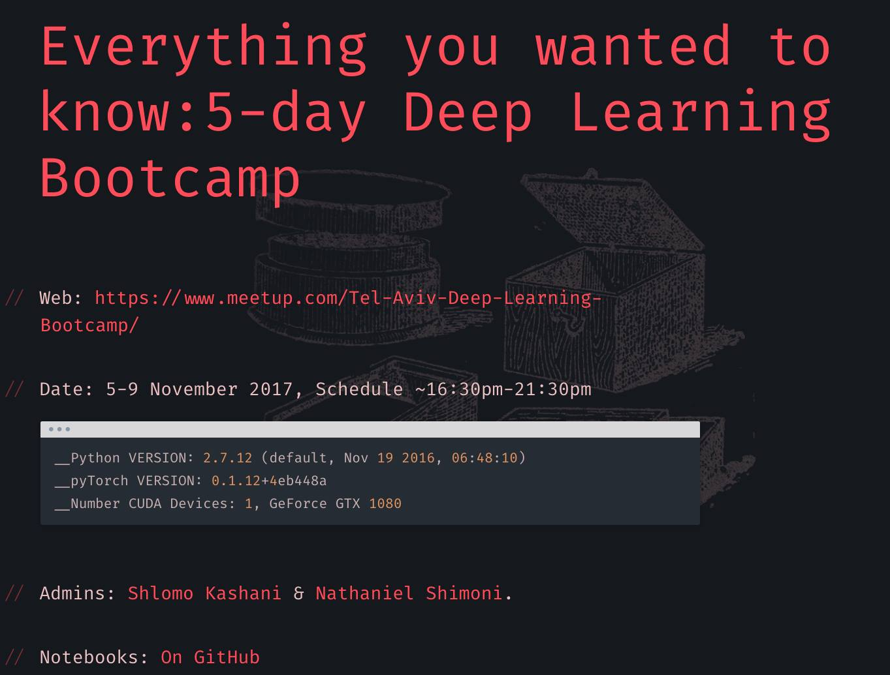

# Deep Learning Winter School: Deep Learning Bootcamp Tel-Aviv meetup. 

This repository includes code / utilities for **the Deep Learning School**:

#### Presentation:
http://deep-ml.com/assets/5daydeep/#/3/1

#### Meetup:
https://www.meetup.com/TensorFlow-Tel-Aviv/events/241762893/

#### Registration:
https://www.eventbrite.com/e/5-day-deep-learning-bootcamp-november-2017-als-fund-raising-tickets-37001430274 

# Agenda:

### day 1
### day 2
### day 3
### day 4
### day 5

### Requirements
- Ubuntu Linux 16.04
- Python 2.7 
- CUDA drivers.Running a CUDA container requires a machine with at least one CUDA-capable GPU and a driver compatible with the CUDA toolkit version you are using.
See https://github.com/QuantScientist/Data-Science-ArrayFire-GPU/tree/master/docker

# Relevant info:

http://deep-ml.com/assets/5daydeep/#/3/1

